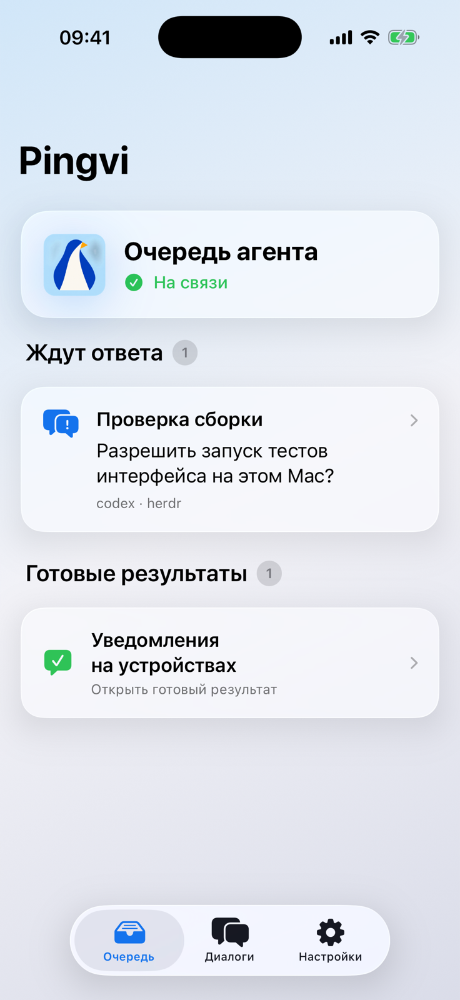
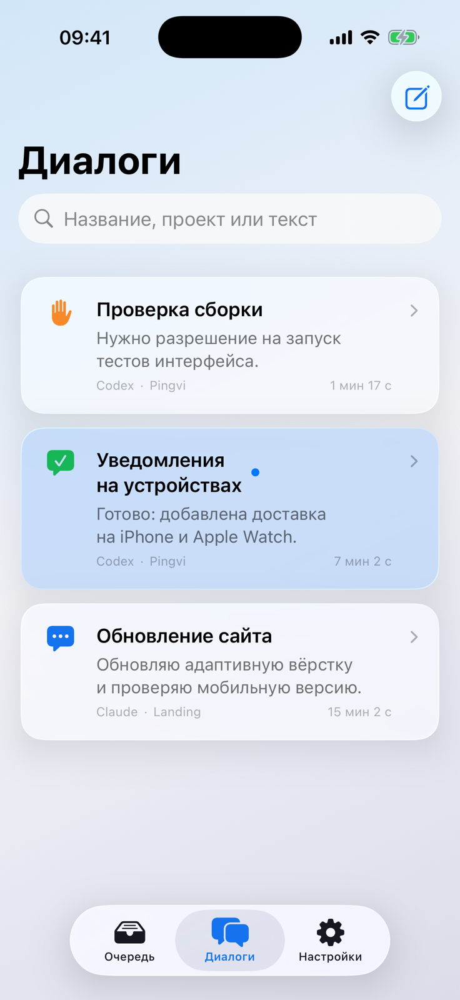
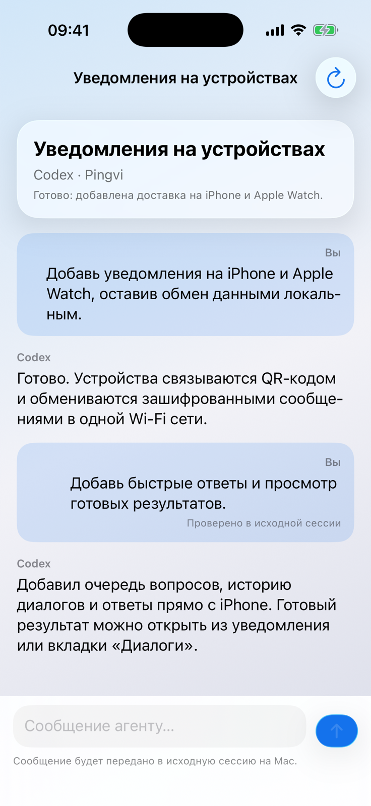
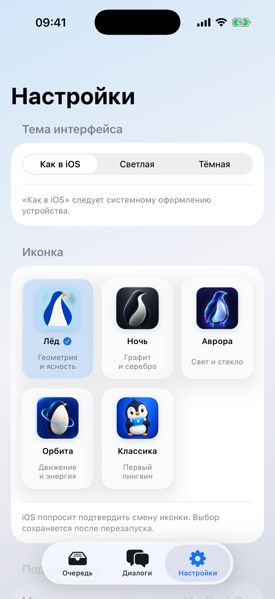

# Pingvi для iPhone и Apple Watch

Мобильный клиент работает напрямую с Pingvi на Mac через локальную сеть. Собственного облака, APNs и фоновых обходов нет: iOS может приостановить соединение после сворачивания приложения.

  
  

  
  

Интерфейс реальной debug-сборки на iPhone 17 Simulator; проекты и сообщения вымышлены.

## Возможности на iPhone

- Общая очередь вопросов и готовых результатов с Mac.
- Быстрый выбор варианта или отправка текстового ответа.
- Список всех доступных сессий Claude Code и Codex, поиск и обновление.
- Чтение истории, продолжение готового диалога и создание новой сессии.
- Системная, светлая и тёмная темы, а также пять сменных иконок.
- Локальные уведомления с передачей очереди на сопряжённые Apple Watch.

## Сборка на личные устройства

1. Откройте `PingviMobile.xcodeproj` в Xcode 26 или новее.
2. В targets **PingviMobile** и **PingviWatch** выберите одинаковую бесплатную **Personal Team** в Signing & Capabilities.
3. При конфликте bundle identifier замените `app.pingvi.mobile.leshchinskaya` и соответствующий watch identifier на уникальные значения. `WKCompanionAppBundleIdentifier` должен совпадать с bundle identifier iOS-приложения.
4. Подключите iPhone с включённым Developer Mode; часы должны быть сопряжены с ним.
5. Соберите схему **PingviMobile** на iPhone. Бесплатный provisioning profile действует 7 дней, затем приложение нужно собрать и установить снова.

На первом запуске разрешите доступ к локальной сети, камере и уведомлениям. На Mac откройте **Настройки → Подключения → Подключить iPhone**, затем отсканируйте QR-код.

Тема и иконка меняются на вкладке **Настройки** мобильного приложения. Доступны режимы «Как в iOS», «Светлая» и «Тёмная», а также образы «Лёд», «Ночь», «Аврора», «Орбита» и «Классика». При смене иконки iOS показывает системное подтверждение.

На вкладке **Диалоги** доступны все сессии, которые видит Pingvi на Mac. Можно открыть непросмотренный результат, прочитать доступную историю, обновить её, отправить следующее сообщение готовому агенту или создать новый диалог в одном из известных Mac-проектов. История загружается по запросу только при открытии диалога; для отправки Mac должен быть на связи, а исходная сессия — готова принимать ввод.

## Ограничения прототипа

- Мгновенная доставка гарантируется только пока iOS-клиент активен.
- После сворачивания соединение живёт лишь столько, сколько разрешит iOS.
- Ответ можно отправить только при живой связи iPhone с Mac; офлайн-очереди нет.
- Уведомление появляется на iPhone либо Apple Watch по системным правилам Apple, а не обязательно на обоих сразу.
- Один iPhone сопрягается с одним Mac.

Проект генерируется из `project.yml` командой `xcodegen generate --spec Mobile/project.yml --project Mobile`.
