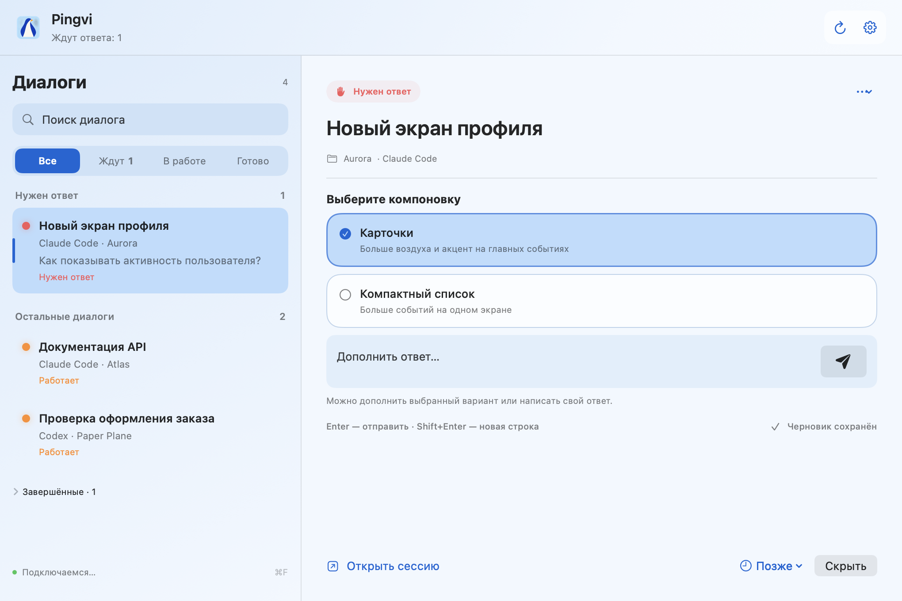

<div align="center">


**Вопросы Claude Code и Codex — в одном окне на Mac.**

Pingvi показывает, какой агент ждёт вашего ответа, уведомляет о завершении работы
и позволяет отвечать на поддерживаемые вопросы прямо из приложения.


[Возможности](#возможности) · [Подключения](#подключения) · [Установка](#установка) · [Скачать DMG](https://github.com/leshchinskaya/pingvi/releases) · [Разработка](docs/DEVELOPMENT.md) · [Сообщить об ошибке](https://github.com/leshchinskaya/pingvi/issues)

</div>

## Как это работает

1. Запустите Claude Code или Codex в поддерживаемом терминале и подключите его в настройках Pingvi.
2. Следите за сессиями в общем списке. Диалоги, которые ждут ответа, отображаются сверху.
3. Выберите вариант или напишите ответ в Pingvi. При необходимости откройте исходную сессию.



<p align="center"><sub>Настоящий интерфейс приложения с вымышленными проектами и вопросами.</sub></p>

## Возможности

| | Что можно делать |
| --- | --- |
| **Общая очередь** | Видеть вопросы и статусы агентов, искать диалоги, переименовывать их и исключать проекты. |
| **Уведомления** | Узнавать о вопросах и готовых ответах через системные баннеры, Dock и строку меню. |
| **Ответы из Pingvi** | Выбирать один или несколько вариантов, добавлять текст и подтверждать действия для поддерживаемых вопросов. |
| **Вернуться позже** | Откладывать вопросы на 5, 15, 30 или 60 минут. Очередь и черновики сохраняются после перезапуска. |
| **Настройка внешнего вида** | Выбирать светлую, тёмную или системную тему и один из пяти обликов пингвина. |
| **Локальные данные** | Управлять сохранёнными текстами и выборочно очищать их в настройках. |

### Ответить, не переключаясь между окнами

Плавающая карточка показывает вопрос поверх других окон. В ней можно выбрать ответ, добавить уточнение, отложить вопрос кнопкой **«Позже»** или **открыть сессию**.

Включите её в **Настройки → Уведомления → Показывать карточку поверх окон**.


<p align="center"><sub>Настоящая карточка Pingvi на демонстрационном фоне редактора. Рабочий стол пользователя не захватывается.</sub></p>

**Enter** отправляет ответ, **Shift+Enter** добавляет новую строку. Можно также нажать кнопку с самолётиком рядом с полем ввода. После отправки Pingvi ждёт изменения состояния агента, прежде чем перейти к следующему вопросу.

### Экспериментальный чат

Включается в **Настройки → Основные → Чат в Pingvi**. Позволяет читать доступную историю, отправлять сообщения и создавать диалоги в herdr. Доступность зависит от подключения — см. таблицу ниже.

Граница **«Новое»** отмечает сообщения после вашего последнего ответа. При возвращении в диалог сохраняется место чтения. Если агент занят, введённый текст остаётся черновиком: для отправки нужно вернуться к нему самостоятельно.

## Подключения

| Источник | Что доступно | Что учитывать |
| --- | --- | --- |
| **Claude Code через hooks** | Вопросы, подтверждения действий и события сессии | Подключите hooks в настройках Pingvi и перезапустите уже открытые сессии Claude. |
| **herdr · Claude / Codex** | Обнаружение сессий, чтение экрана, поддерживаемые ответы и создание диалогов | Результат ввода определяется по изменению экрана. Для вложенных панелей иногда нужен ручной выбор. |
| **Apple Terminal** | Обнаружение и чтение вкладок, переход к сессии и поддерживаемые ответы | Требуется разрешение Automation для Terminal. |
| **Warp · Claude** | Вопросы через hooks, доступная история и переход по ссылке сессии | Новые сообщения вводятся в самом Warp. |
| **iTerm / Ghostty** | Пока не поддерживаются | — |

**Pingvi находится в beta.** Распознавание вопросов зависит от интерфейса CLI. Если результат отправки неизвестен, приложение предлагает проверить исходную сессию и не повторяет отправку автоматически.

## Установка

**[Скачать Pingvi 0.7.0 beta 3 — DMG для Apple Silicon](https://github.com/leshchinskaya/pingvi/releases/download/v0.7.0-beta.3/Pingvi-0.7.0-beta.3-arm64.dmg)**

[Все версии и контрольные суммы SHA-256 — в GitHub Releases](https://github.com/leshchinskaya/pingvi/releases).

Для запуска нужны **Mac с Apple Silicon и macOS 14+**, а также установленный и авторизованный **Claude Code или Codex CLI**. Для подключения сессий herdr и создания в нём диалогов установите herdr отдельно.

Python входит в собранное приложение. Для его запуска отдельные Python, Xcode и Homebrew не нужны.

### Сборка из исходников

Для сборки нужны Xcode с macOS SDK и Python 3.12+. При первой сборке скачивается закреплённый архив Python с GitHub и проверяется его SHA-256.

```sh
git clone https://github.com/leshchinskaya/pingvi.git
cd pingvi
bash tools/package-dmg.sh
```

Готовый образ `Pingvi-<версия>-arm64.dmg` появится в каталоге `dist/`.

### Первый запуск

1. Откройте DMG и перетащите **Pingvi.app** в **Программы**.
2. Извлеките образ и запустите установленное приложение.
3. Нажмите **«Настроить»**: проверьте CLI, подключите Claude hooks при использовании Claude и выдайте нужные разрешения.
4. Перезапустите ранее открытые сессии Claude после установки hooks.
5. Проверьте подключение: дождитесь вопроса агента, ответьте через Pingvi и убедитесь, что ответ появился в исходной сессии.

Сборка по умолчанию подписана локально (ad-hoc), без Developer ID и notarization. Если macOS блокирует доверенную сборку, используйте **«Всё равно открыть»** в разделе **Конфиденциальность и безопасность**. [Инструкция Apple](https://support.apple.com/guide/mac-help/mh40616/mac).

<details>
<summary><strong>Разрешения</strong></summary>

- **Уведомления** — системные баннеры о вопросах и готовых ответах.
- **Automation → Terminal** — чтение вкладок Terminal и переход к ним.
- **Универсальный доступ** — список сессий при наведении на Dock. Для строки меню это разрешение не требуется.

Pingvi изменяет настройки Claude после нажатия **«Подключить / обновить»**. Перед изменением сохраняется резервная копия; существующие hooks других инструментов сохраняются.

</details>

<details>
<summary><strong>Обновление и удаление</strong></summary>

Для обновления завершите Pingvi через **⌘Q** и замените приложение в той же папке. Очередь и черновики сохранятся. Проверьте подключения и при необходимости обновите Claude hooks.

Перед удалением отключите Claude в разделе **«Подключения»** и перезапустите его сессии. Затем завершите и удалите Pingvi. Сохранённые тексты можно очистить в разделе **«Данные»**.

</details>

## Данные и приватность

У Pingvi нет собственного облака или учётной записи. Приложение работает с локальными CLI, файлами и системными API macOS. Агенты используют свои подключения к провайдерам.

Очередь и черновики хранятся в `~/Library/Application Support/AgentAttention`. История читается из журналов агентов. При очистке текстов сохраняются сведения, необходимые для защиты от повторной отправки; неподтверждённые отправки остаются до проверки.

Подробнее: [данные и разрешения](docs/PRIVACY.md).

## Разработка

```sh
swift test
python3 -m unittest discover -s Tests
```

| Каталог | Содержимое |
| --- | --- |
| `Sources/AgentAttention` | Интерфейс SwiftUI / AppKit, очередь, настройки и уведомления |
| `bridge` | Локальные адаптеры, hooks, чат и управление данными |
| `TestsSwift` / `Tests` | Проверки Swift и Python |
| `tools` | Сборка, упаковка и проверки приложения |
| `Assets` | Иконки и лицензии зависимостей |

[Инструкция по сборке, проверке релиза и обновлению скриншотов](docs/DEVELOPMENT.md).

В планах: Developer ID и notarization, проверка на другом Mac и матрица версий CLI, автозапуск, улучшение обновлений и поддержка других терминалов.

Нашли проблему? [Создайте issue](https://github.com/leshchinskaya/pingvi/issues): укажите версию macOS, источник сессии и шаги воспроизведения. Перед публикацией удалите ключи и приватную переписку.
