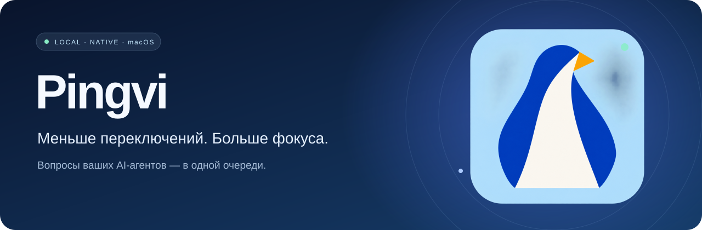
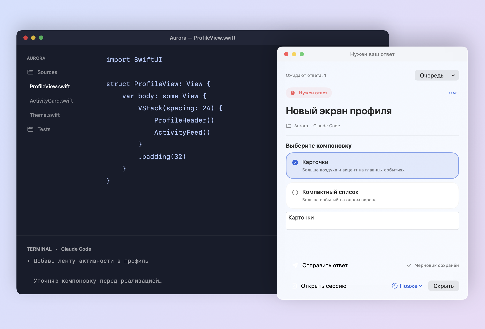

<div align="center">



**Ваши агенты работают. Pingvi приносит вопросы.**

Нативное приложение для macOS, которое собирает сессии Claude Code и Codex
в одну очередь — с уведомлениями, черновиками и ответами прямо из окна приложения.


[Возможности](#возможности) · [Подключения](#подключения) · [Установка](#установка) · [Разработка](docs/DEVELOPMENT.md) · [Сообщить об ошибке](https://github.com/leshchinskaya/pingvi/issues)

</div>

<br>


<p align="center"><sub>Настоящий интерфейс приложения. Все задачи и проекты на скриншоте — демонстрационные.</sub></p>

## Один взгляд вместо десятка вкладок

Когда несколько агентов работают одновременно, легко пропустить вопрос или забыть про готовый ответ. Pingvi показывает, кому нужно ваше внимание: в Dock, строке меню и общем списке диалогов.

Вы продолжаете запускать агентов привычным способом. Pingvi помогает следить за ними и возвращаться к нужной сессии.

### Вопрос появляется поверх окон

Агенту нужно уточнение — Pingvi показывает плавающую карточку поверх других окон. Сразу видно, какая сессия и проект ждут ответа: выберите вариант или напишите своё уточнение и нажмите **«Отправить ответ»**. Для поддерживаемых вопросов ответ уйдёт в исходную сессию ИИ.



<p align="center"><sub>Настоящий интерфейс карточки на демонстрационном фоне редактора. Проект и переписка вымышлены.</sub></p>

Включается в **Настройки → Уведомления → Показывать карточку поверх окон**. Если сейчас неудобно отвечать, нажмите **«Позже»**; для перехода к агенту — **«Открыть сессию»**.

## Возможности

| | Что умеет Pingvi |
| --- | --- |
| 🔔 **Внимание по делу** | Отдельные уведомления о вопросах и готовых ответах. Плавающая карточка включается по желанию. |
| 💬 **Ответы рядом** | Варианты, множественный выбор и свободный текст для поддерживаемых вопросов. Подробности действия перед подтверждением. |
| 🧭 **Общая очередь** | Поиск, фильтры, переименование и исключение проектов. Ожидающие ответа диалоги — сверху. |
| ⏰ **Можно вернуться позже** | Напоминания на 5, 15, 30 или 60 минут. Черновики и очередь переживают перезапуск. |
| 🐧 **Своя атмосфера** | Светлая, тёмная и системная темы. Пять обликов пингвина, независимый выбор иконок. |
| 🗂️ **Контроль данных** | Локальное хранение и выборочная очистка. Защита от повторной отправки сохраняется после удаления текста. |

### Чат — когда нужен

Экспериментальный чат включается в **Настройки → Основные → Чат в Pingvi**. Он позволяет читать доступную историю, отправлять сообщения и создавать диалоги в herdr.

**⌘Enter** отправляет сообщение. Если агент занят, текст остаётся черновиком: автоматической отправки после завершения нет. Запросы разрешений показываются отдельно.

## Подключения

| Источник | Что доступно | Границы поддержки |
| --- | --- | --- |
| **Claude Code · hooks** | Вопросы, подтверждения действий, события сессии | Разовая установка из настроек; старые сессии нужно перезапустить. |
| **herdr · Claude / Codex** | Обнаружение сессий, чтение экрана, поддерживаемые ответы, создание диалогов | Для экранного ввода доставка определяется по состоянию, без надёжной квитанции агента. |
| **Apple Terminal** | Обнаружение вкладок, чтение и переход; поддерживаемые ответы | Требуется разрешение Automation. |
| **Warp · Claude** | Вопросы через hooks, доступная история и переход по ссылке сессии | Новые сообщения вводятся в Warp; полного управления вводом нет. |
| **iTerm / Ghostty** | — | Пока не подключены. |

> **Это beta.** Распознавание экранов зависит от интерфейса CLI. Если результат отправки неизвестен, Pingvi предлагает проверить исходную сессию. Автоматических повторов нет. В herdr точная фокусировка вложенной панели может потребовать ручного выбора.

## Установка

**Для запуска:** Mac с Apple Silicon, macOS 14+, установленный и авторизованный Claude Code или Codex CLI. Для сессий herdr и создания новых диалогов нужен установленный herdr.

Python входит в собранное приложение. Отдельные Python, Xcode и Homebrew для запуска Pingvi не нужны.

### Собрать приложение из кода

На компьютере разработчика нужны Xcode с macOS SDK и Python 3.12+. Первая сборка скачивает закреплённый архив Python с GitHub и проверяет его SHA-256.

```sh
git clone https://github.com/leshchinskaya/pingvi.git
cd pingvi
bash tools/package-dmg.sh
```

Готовый образ появится в `dist/Pingvi-0.7.0-beta.3-arm64.dmg`.

1. Перетащите **Pingvi.app** из образа в **Программы**.
2. Извлеките DMG и откройте установленное приложение.
3. Нажмите **Настроить**: проверьте CLI, подключите Claude hooks и выдайте нужные разрешения.
4. Получите первый вопрос в тестовой сессии и проверьте ответ в исходном окне.

Сборка по умолчанию имеет локальную **ad-hoc подпись**, без Developer ID и notarization. macOS может заблокировать первый запуск. Для доверенной сборки используйте предусмотренное Apple действие «Всё равно открыть» в **Конфиденциальность и безопасность**. [Инструкция Apple](https://support.apple.com/guide/mac-help/mh40616/mac).

<details>
<summary><strong>Какие разрешения нужны?</strong></summary>

- **Уведомления** — для системных баннеров.
- **Automation → Terminal** — для чтения обычных вкладок и перехода к ним.
- **Универсальный доступ** — только для списка при наведении на Dock. Строка меню работает без него.

Настройки Claude изменяются по нажатию «Подключить / обновить». Перед изменением сохраняется резервная копия; чужие hooks сохраняются.

</details>

<details>
<summary><strong>Как обновить или удалить?</strong></summary>

Завершите Pingvi через ⌘Q и замените приложение в той же папке. Черновики и очередь хранятся отдельно. После обновления проверьте подключения и при необходимости обновите Claude hooks.

Перед удалением отключите Claude в разделе «Подключения» и перезапустите его сессии. Затем завершите и удалите Pingvi. Управлять локальными текстами можно в разделе «Данные».

</details>

## Локально по устройству

В Pingvi нет собственного облака или учётной записи. Приложение взаимодействует с локальными CLI, файлами и системными API macOS; сами агенты используют свои подключения к провайдерам.

Очередь и черновики хранятся в `~/Library/Application Support/AgentAttention`. История читается из журналов агентов. Неподтверждённые отправки сохраняются до проверки, даже при очистке обработанных текстов.

Подробнее: [данные и разрешения](docs/PRIVACY.md).

## Для разработчиков

```sh
swift test
python3 -m unittest discover -s Tests
```

| Каталог | Назначение |
| --- | --- |
| `Sources/AgentAttention` | SwiftUI, AppKit, очередь, настройки и уведомления |
| `bridge` | Локальные адаптеры, hooks, чат и управление данными |
| `TestsSwift` / `Tests` | Проверки Swift и Python |
| `tools` | Сборка, упаковка и проверки готового приложения |
| `Assets` | Иконки и лицензии зависимостей |

[Сборка и проверка релиза →](docs/DEVELOPMENT.md)

## Что дальше

- [ ] Developer ID и notarization.
- [ ] Полная проверка на другом Mac и матрица поддерживаемых версий CLI.
- [ ] Автозапуск и более удобное обновление.
- [ ] Расширение поддержки терминалов.

Нашли проблему? [Создайте issue](https://github.com/leshchinskaya/pingvi/issues) с версией macOS, источником сессии и шагами воспроизведения. Удалите из примеров ключи, рабочую переписку и другие приватные данные.

---

<p align="center">Маленький пингвин. Чуть больше спокойствия в рабочем дне.</p>
