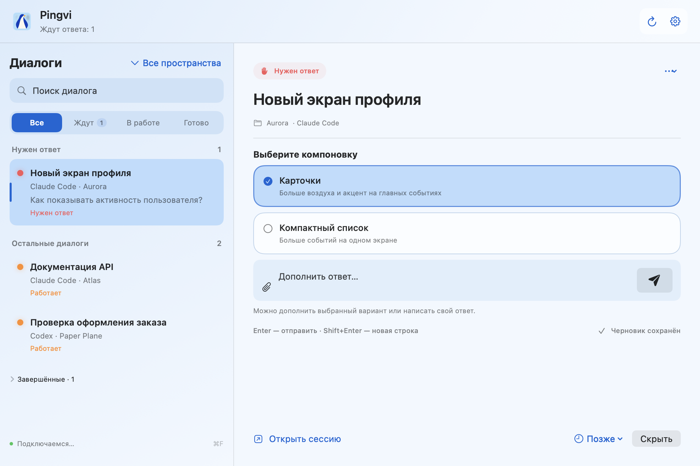

<div align="center">


**Вопросы Claude Code и Codex — в одном окне на Mac.**

Pingvi показывает, какой агент ждёт вашего ответа, уведомляет о завершении работы
и позволяет отвечать на поддерживаемые вопросы прямо из приложения. Объединяйте диалоги
в рабочие пространства и добавляйте к ответам ссылки на локальные файлы и скриншоты.


[Возможности](#возможности) · [Подключения](#подключения) · [Установка](#установка) · [Скачать DMG](https://github.com/leshchinskaya/pingvi/releases) · [Разработка](docs/DEVELOPMENT.md)

</div>

## Как это работает

1. Запустите Claude Code или Codex в поддерживаемом терминале и подключите его в настройках Pingvi.
2. Следите за сессиями в общем списке или объедините их в пространство одной задачи. Диалоги, которые ждут ответа, отображаются сверху.
3. Выберите вариант или напишите ответ в Pingvi. При необходимости откройте исходную сессию.



<p align="center"><sub>Настоящий интерфейс приложения с вымышленными проектами и вопросами.</sub></p>

## Возможности

| | Что можно делать |
| --- | --- |
| **Общая очередь** | Видеть вопросы и статусы агентов, искать диалоги, переименовывать их и исключать проекты. |
| **Рабочие пространства** | Объединять диалоги Claude и Codex вокруг одной задачи, переключать группы и управлять ими из меню в заголовке. |
| **Вложения** | Выбирать файлы и скриншоты в текстовых ответах и чате; агент получает ссылки на локальные пути. |
| **Уведомления** | Узнавать о вопросах и готовых ответах через системные баннеры, Dock и строку меню. |
| **Ответы из Pingvi** | Выбирать один или несколько вариантов, добавлять текст и подтверждать действия для поддерживаемых вопросов. |
| **Вернуться позже** | Откладывать вопросы на 5, 15, 30 или 60 минут. Очередь и черновики сохраняются после перезапуска. |
| **Настройка внешнего вида** | Выбирать светлую, тёмную или системную тему и один из пяти обликов пингвина. |
| **Локальные данные** | Управлять сохранёнными текстами и выборочно очищать их в настройках. |
| **Заметки к диалогам** | Сохранять личные напоминания о следующем шаге; заметки не отправляются агентам. |
| **Шаблоны ответов** | Создавать свои заготовки и вставлять их в черновик через меню поля ввода. |
| **Обзор результатов** | Читать последние ответы завершивших работу агентов и отмечать их просмотренными. |

### Ответить, не переключаясь между окнами

Плавающая карточка показывает вопрос поверх других окон. В ней можно выбрать ответ, добавить уточнение, отложить вопрос кнопкой **«Позже»** или **открыть сессию**.

Включите её в **Настройки → Уведомления → Показывать карточку поверх окон**.


<p align="center"><sub>Настоящая карточка Pingvi на демонстрационном фоне редактора. Рабочий стол пользователя не захватывается.</sub></p>

**Enter** отправляет ответ, **Shift+Enter** добавляет новую строку. Можно также нажать кнопку с самолётиком рядом с полем ввода. После отправки Pingvi ждёт изменения состояния агента, прежде чем перейти к следующему вопросу.

Перед вопросом отображается **«Контекст»**: последнее сообщение пользователя и последний доступный текст агента перед вопросом из локальной истории. По умолчанию блок занимает одну строку с превью последнего сообщения. Нажатие на строку раскрывает полный текст; повторное нажатие сворачивает его. Блок доступен в обычной и плавающей карточках, включая карточку запроса из чата, и работает при выключенном экспериментальном чате. Это выдержки из переписки; если история недоступна или неполна, Pingvi сообщает об этом.

### Вложения к ответам

Нажмите скрепку в поле ответа или чате и выберите один или несколько файлов, включая скриншоты. Во всплывающей карточке окно выбора файлов открывается поверх неё; отмена сохраняет исходный черновик. Pingvi добавит в текст просьбу прочитать файлы с их локальными путями. Ссылки сохраняются вместе с черновиком; чтобы убрать вложение, удалите соответствующую строку.

Файлы не копируются и не загружаются как нативные изображения: агенту нужен доступ к указанным путям и возможность прочитать соответствующий формат. Перед отправкой Pingvi проверяет доступность файлов. Вложения доступны в текстовых ответах; у подтверждений, состоящих только из кнопок, поля вложений нет.

### Скриншот из буфера обмена

Скопируйте скриншот в буфер (например, **⌃⇧⌘4**) и нажмите **⌘V** в поле ответа или чата. Pingvi сохраняет изображение PNG в `~/Library/Application Support/AgentAttention/clipboard-images` и добавляет ссылку в текущий черновик. Обычный текст вставляется как прежде. Изображения также можно вставлять через меню **Правка → Вставить**. Отправка выполняется отдельно.

Скриншоты сохраняются после перезапуска. Удаление строки вложения не удаляет файл; папку можно открыть через **Настройки → Данные → Открыть вставленные скриншоты**. Агенту требуется доступ к локальному пути, как и для обычных файловых вложений.

### Заметки и шаблоны

Кнопка **«Заметка»** в карточке и чате открывает личную заметку к диалогу. Она также доступна из контекстного меню списка. Нажмите **«Сохранить»**, чтобы сохранить текст; **«Очистить» → «Сохранить»** удаляет заметку. Заполненная заметка сразу видна под заголовком чата и карточки вопроса (до двух строк); нажатие открывает её целиком для редактирования. В списке диалогов отображается первая строка. Заметки не попадают в сообщения агентам.

Меню **«Шаблоны ответов»** рядом со скрепкой вставляет выбранный текст в конец черновика. Через **«Управлять шаблонами…»** можно создавать, редактировать и удалять шаблоны. Вначале доступны заготовки для проверки крайних случаев, добавления тестов и просмотра diff. Выбор шаблона не отправляет сообщение.

### Обзор готовых результатов

Нажмите **«Обзор результатов»** под фильтрами диалогов. Для выбранного пространства показываются последние доступные ответы агентов с непросмотренными результатами. Длинный ответ можно развернуть; **«Просмотрено»** убирает его из текущего обзора. Переключатель **«Показывать просмотренные»** возвращает такие результаты в список. Открытие обзора само по себе не помечает ответы прочитанными.

Если локальная история недоступна, карточка предлагает перейти в исходную сессию или повторить загрузку. Завершение ответа агента не означает, что вся задача выполнена.

### Рабочие пространства

Создайте пространство через меню **«Все пространства» → «Создать пространство…»** в заголовке списка диалогов. Через контекстное меню диалога → **Рабочее пространство** добавьте в него сессии Claude и Codex, относящиеся к одной задаче. Каждый диалог принадлежит одному пространству; общий список по-прежнему показывает все диалоги.

Переключатель пространства находится рядом с заголовком **«Диалоги»**; ниже — поиск и фильтры статусов. Отдельный счётчик **«Ждут»** показывает число ожидающих вопросов в выбранном пространстве. Для переименования или удаления откройте **«Управлять пространствами…»** в том же меню.

Группы и назначения сохраняются после перезапуска. Пространство можно переименовать или удалить — его диалоги останутся в общем списке. Уведомления продолжают приходить для всех пространств.

### Поиск по переписке

Поле **«Поиск диалогов и сообщений»** ищет по названиям и доступной локальной переписке Claude и Codex без учёта регистра. Под списком диалогов появляются фрагменты совпадений с названием сессии, проектом и автором сообщения. Нажатие открывает историю на выбранном сообщении с подсветкой совпадений; экспериментальный чат включать не нужно.

Поиск учитывает выбранное пространство и фильтр статуса. Для каждого диалога доступны до 200 последних сообщений из последних 4 МБ журнала; недоступная или неполная история обозначается отдельно. Переписка загружается на время поиска и не сохраняется в отдельный индекс. Кнопка обновления рядом с заголовком **«Сообщения»** перечитывает историю, чтобы найти новые ответы.

### Экспериментальный чат

Включается в **Настройки → Основные → Чат в Pingvi**. Позволяет читать доступную историю, отправлять сообщения и создавать диалоги в herdr. Доступность зависит от подключения — см. таблицу ниже.

Граница **«Новое»** отмечает сообщения после вашего последнего ответа. При возвращении в диалог сохраняется место чтения. Если агент занят, введённый текст остаётся черновиком: для отправки нужно вернуться к нему самостоятельно.

## Подключения

| Источник | Что доступно | Что учитывать |
| --- | --- | --- |
| **Claude Code через hooks** | Вопросы, подтверждения действий и события сессии | Подключите hooks в настройках Pingvi и перезапустите уже открытые сессии Claude. |
| **herdr · Claude / Codex** | Обнаружение сессий, чтение экрана, поддерживаемые ответы и создание диалогов | Результат ввода определяется по изменению экрана. Для вложенных панелей иногда нужен ручной выбор. |
| **Apple Terminal** | Обнаружение и чтение вкладок, переход к сессии и поддерживаемые ответы | Требуется разрешение Automation для Terminal. |
| **Warp · Claude** | Вопросы через hooks, доступная история и переход по ссылке сессии | Новые сообщения вводятся в самом Warp. |
| **iTerm / Ghostty** | Пока не поддерживаются | — |

**Pingvi находится в beta.** Распознавание вопросов зависит от интерфейса CLI. Если результат отправки неизвестен, приложение предлагает проверить исходную сессию и не повторяет отправку автоматически.

## Установка

**0.7.0 beta 10**: исправлено зависание интерфейса при длительной работе — скрытые окна больше не обновляют чат в фоне, а неизменившаяся история не запускает повторную перерисовку. Также доступны исправления доставки уведомлений, поиск по переписке, личные заметки, скриншоты через ⌘V, шаблоны ответов и обзор готовых результатов. Скриншоты выше показывают интерфейс beta 5.

**[Скачать Pingvi 0.7.0 beta 10 — DMG для Apple Silicon](https://github.com/leshchinskaya/pingvi/releases/download/v0.7.0-beta.10/Pingvi-0.7.0-beta.10-arm64-adhoc.dmg)**

[Все версии и контрольные суммы SHA-256 — в GitHub Releases](https://github.com/leshchinskaya/pingvi/releases).

Для запуска нужны **Mac с Apple Silicon и macOS 14+**, а также установленный и авторизованный **Claude Code или Codex CLI**. Для подключения сессий herdr и создания в нём диалогов установите herdr отдельно.

Python входит в собранное приложение. Для его запуска отдельные Python, Xcode и Homebrew не нужны.

### Сборка из исходников

Для сборки нужны Xcode с macOS SDK и Python 3.12+. При первой сборке скачивается закреплённый архив Python с GitHub и проверяется его SHA-256.

```sh
git clone https://github.com/leshchinskaya/pingvi.git
cd pingvi
bash tools/package-dmg.sh --local
```

Для beta с явно обозначенной ad-hoc подписью используйте `bash tools/package-dmg.sh --adhoc`: образ получит суффикс `-adhoc`; notarization не выполняется.

Для локального тестирования создаётся `dist/Pingvi-0.7.0-beta.10-arm64-local.dmg` и SHA-256 рядом. Для распространяемой сборки используйте `bash tools/package-dmg.sh --release`: нужны `SIGNING_IDENTITY` (Developer ID Application) и `NOTARY_PROFILE`. Скрипт требует notarization и проверку Gatekeeper.

### Первый запуск

1. Откройте DMG и перетащите **Pingvi.app** в **Программы**.
2. Извлеките образ и запустите установленное приложение.
3. Нажмите **«Настроить»**: проверьте CLI, подключите Claude hooks при использовании Claude и выдайте нужные разрешения.
4. Перезапустите ранее открытые сессии Claude после установки hooks.
5. Проверьте подключение: дождитесь вопроса агента, ответьте через Pingvi и убедитесь, что ответ появился в исходной сессии.

Опубликованная beta 10 и локальные тестовые сборки подписаны ad-hoc, без Developer ID и notarization: Gatekeeper может блокировать их запуск. Если вы доверяете этой сборке, после попытки запуска используйте **«Всё равно открыть»** в разделе **Конфиденциальность и безопасность**. На управляемом Mac это может запрещать политика организации. [Инструкция Apple](https://support.apple.com/en-gb/102445).

### Если установка или уведомления не работают

- Эта сборка требует **Apple Silicon и macOS 14+**. Для Intel она не подходит.
- DMG — образ диска: перенесите приложение в **Программы**, извлеките образ и запускайте установленную копию. Запрос уведомлений выполняйте после переноса.
- Если сам DMG не открывается, скачайте его заново вместе с `.sha256` из того же релиза и проверьте `shasum -a 256 -c Pingvi-0.7.0-beta.10-arm64-adhoc.dmg.sha256` в папке загрузки.
- В **Настройки → Уведомления** проверьте переключатели вопросов и завершения. Статус **«Только Центр уведомлений»** означает, что всплывающие баннеры выключены: откройте настройки macOS для Pingvi и выберите «Баннеры» или «Предупреждения».
- Нажмите **«Тестовое уведомление»**. Pingvi покажет отказ macOS или факт передачи запроса. Успешная передача не доказывает появление баннера: проверьте «Фокусирование» и настройки показа при дублировании экрана.
- **«Копировать диагностику уведомлений»** копирует версию macOS и Pingvi, настройки разрешений и результат последней попытки без текстов диалогов. Приложите её к сообщению о проблеме.

<details>
<summary><strong>Разрешения</strong></summary>

- **Уведомления** — системные баннеры о вопросах и готовых ответах.
- **Automation → Terminal** — чтение вкладок Terminal и переход к ним.
- **Универсальный доступ** — список сессий при наведении на Dock. Для строки меню это разрешение не требуется.

Pingvi изменяет настройки Claude после нажатия **«Подключить / обновить»**. Перед изменением сохраняется резервная копия; существующие hooks других инструментов сохраняются.

</details>

<details>
<summary><strong>Обновление и удаление</strong></summary>

Для обновления завершите Pingvi через **⌘Q** и замените приложение в той же папке. Очередь и черновики сохранятся. Проверьте подключения и при необходимости обновите Claude hooks.

Перед удалением отключите Claude в разделе **«Подключения»** и перезапустите его сессии. Затем завершите и удалите Pingvi. Сохранённые тексты можно очистить в разделе **«Данные»**.

</details>

## Данные и приватность

У Pingvi нет собственного облака или учётной записи. Приложение работает с локальными CLI, файлами и системными API macOS. Агенты используют свои подключения к провайдерам.

Очередь и черновики хранятся в `~/Library/Application Support/AgentAttention`. История читается из журналов агентов. При очистке текстов сохраняются сведения, необходимые для защиты от повторной отправки; неподтверждённые отправки остаются до проверки.

Подробнее: [данные и разрешения](docs/PRIVACY.md).

## Разработка

```sh
swift test
python3 -m unittest discover -s Tests
```

| Каталог | Содержимое |
| --- | --- |
| `Sources/AgentAttention` | Интерфейс SwiftUI / AppKit, очередь, настройки и уведомления |
| `bridge` | Локальные адаптеры, hooks, чат и управление данными |
| `TestsSwift` / `Tests` | Проверки Swift и Python |
| `tools` | Сборка, упаковка и проверки приложения |
| `Assets` | Иконки и лицензии зависимостей |

[Инструкция по сборке, проверке релиза и обновлению скриншотов](docs/DEVELOPMENT.md).
